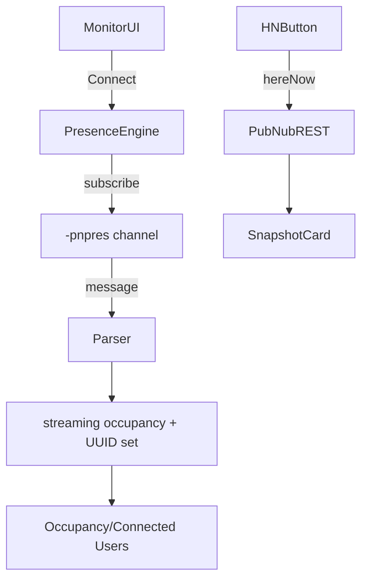

## Presence V2 – Working Notes

### Current status
- `/presence-v2` now renders the top control band with three live components (Channel Monitor, streaming Occupancy, Connected Users) plus a separate “Here Now Snapshot” card.
- The monitor subscribes **only** to `"<channel>-pnpres"` so it never adds itself to channel occupancy.
- Streaming occupancy/UUIDs react to real-time presence events (join/leave/timeout/state-change + interval batches). Tested manually: values update correctly.
- The Here Now button issues an on-demand `hereNow()` call against whichever channel text is entered (or the active channel if connected) and renders results in the snapshot card without touching the live stream.
- Console error about `/sdk-versions.json` is neutralized—local manifest is optional; loader skips missing/non‑JSON responses.

### Data flow overview


1. **Connection lifecycle**
   - `handleConnect` trims the text box and sets `activeChannel`. No presence data is fetched here—stream starts when subscription events arrive.
   - `presenceChannel` memo derives `"<channel>-pnpres"`; `useEffect` subscribes to that channel and attaches a listener (for both `message` and `presence` callbacks).
   - On unmount/disconnect we unsubscribe and wipe local streaming state (`resetPresenceState` clears occupancy, UUIDs, snapshot).

2. **Streaming update pipeline**
   - Listener hands each envelope to `parsePresenceMessage` (new file: `src/lib/presence/presence-parser.ts`).
   - Parser normalises the variety of payload shapes (`m[].d`, metadata `u`, raw presence event, interval arrays). Returns:
     ```ts
     ParsedPresenceEvent {
       presenceChannel, baseChannel, action, uuid,
       occupancy, timestamp, join/leave/timeout arrays,
       state, timetoken, raw, publisher
     }
     ```
   - `applyPresenceUpdate` consumes parsed events, updating:
     - `occupancy` when provided,
     - `connectedUUIDs` via add/remove semantics (handles single and interval batches),
     - `lastPresenceEvent` for debugging (`window.__PRESENCE_DEBUG__`).

3. **Here Now snapshot pipeline**
   - Button triggers `hydratePresenceFromHereNow(channel)` which:
     - Calls `pubnub.hereNow()` with `includeUUIDs: true`.
     - Stores the result in `snapshotData = { channel, occupancy, uuids, timestamp }`.
     - Does **not** change streaming occupancy/UUIDs; the snapshot card simply renders the stored data (small fonts, scrollable list).
   - Button remains enabled even if not connected; requires a channel value.

4. **Debug hooks**
   - `window.__PRESENCE_DEBUG__` exposes `{ occupancy, connectedUUIDs, snapshotData, lastPresenceEvent }` to help future debugging/testing.

### Key files
| Path | Purpose |
|------|---------|
| `src/pages/presence-v2.tsx` | Main React component (UI + hooks + state). |
| `src/lib/presence/presence-parser.ts` | Robust parser translating raw PubNub envelopes (+ metadata) into useful presence events. |
| `src/lib/sdk-loader.ts` | Now tolerates missing `/sdk-versions.json`; avoids console noise. |

### Component skeleton (for quick orientation)
```tsx
const [inputChannel, setInputChannel] = useState(DEFAULT_CHANNEL);
const [activeChannel, setActiveChannel] = useState<string | null>(null);
const [isMonitoring, setIsMonitoring] = useState(false);
const [connectedUUIDs, setConnectedUUIDs] = useState<string[]>([]);
const [occupancy, setOccupancy] = useState(0);
const [snapshotData, setSnapshotData] =
  useState<{ channel: string; occupancy: number; uuids: string[]; timestamp: number | null } | null>(null);

const presenceChannel = useMemo(
  () => (activeChannel ? `${activeChannel}-pnpres` : null),
  [activeChannel]
);

// On connect: set activeChannel, subscribe via useEffect, stream events update occupancy/UUIDs.
// Here Now button: await hydratePresenceFromHereNow -> setSnapshotData -> render mini card.
```

### Future extension hooks
- **Presence state panel:** parser already exposes `state` (from metadata as well). Add to `applyPresenceUpdate` once UI is ready.
- **Interval diagnostics:** `join/leave/timeout` arrays preserved; can surface in a “recent activity” table.
- **Presence metadata logging:** `lastPresenceEvent.raw` is stored for precise replay/testing.
- **Snapshot diffing:** `snapshotData` vs streaming state can power health-checks (e.g., stale stream detection).

### Things to remember (next session)
1. The streaming occupancy tile intentionally shows `--` until monitoring is active. Verify UI copy if behaviour changes.
2. When testing, ensure at least one non-monitor client joins with same keys; the preview remains silent (doesn’t alter counts).
3. If you simulate via Playwright again, the silent listener works but the snapshot button is easier to verify with manual `hereNow`.
4. Manifest warning is gone; no further work needed unless we introduce a real local manifest.
5. All tests compile (`npm run check`) and manual verification confirmed join/leave updates. Ready to build next panels (state view, session history, presence metrics, etc.).
